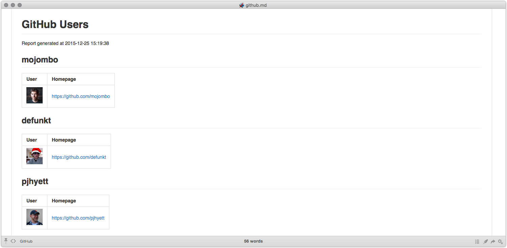
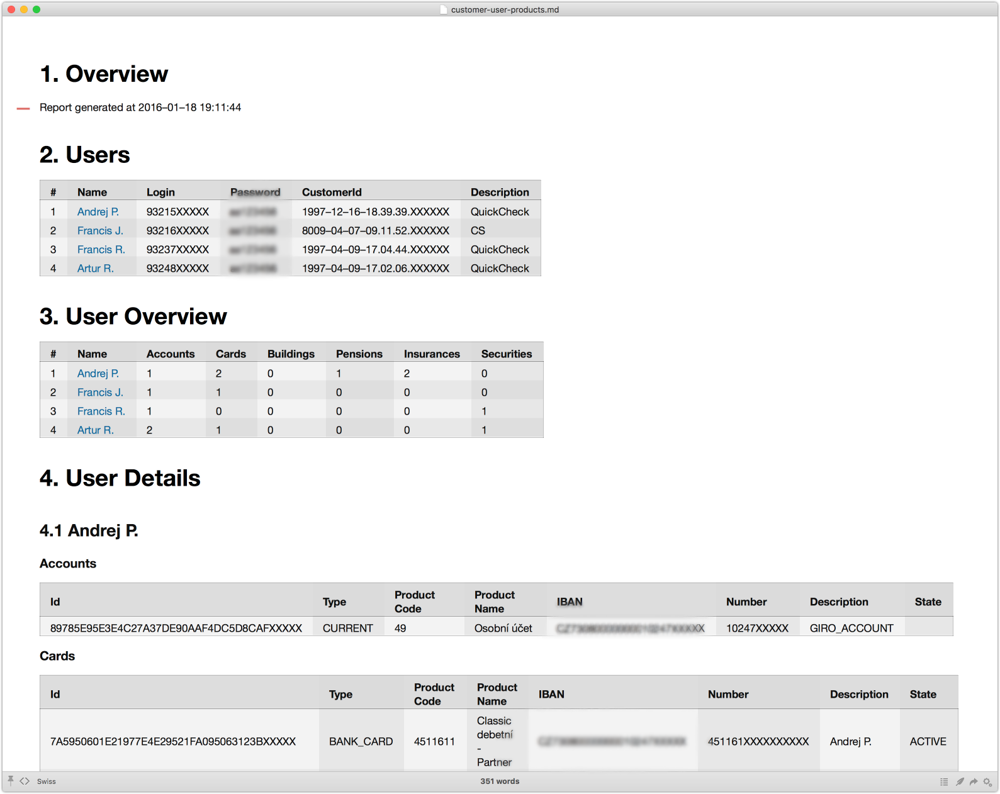
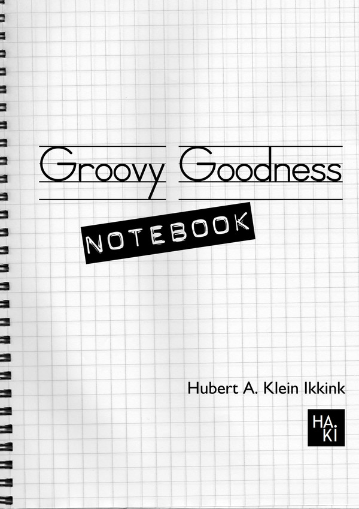

# Bash is Dead - Long Live Groovy Scripting

# Abstract

Some tasks at hand are too complex for shell scripting and not large enough for a full-blown project. Therefore Siegfried used various scripting languages (Perl, Tcl, JavaScript, Ruby) over the years and finally settled for Groovy. Let's join him on his journey of Groovy Goodness and show off some cool features such as networking, JSON processing, library management, command line parsing and configuration files.

# Why Use Scripting

* Some tasks are hard using shell scripting 
* The same tasks might be too small for a Maven/Java setup
* Rapid feedback & bug fixing

# Getting Hooked On Groovy

Came across the following slide: http://www.slideshare.net/davsclaus/apache-camel-gr8conf

```groovy
import org.apache.camel.builder.RouteBuilder;
import org.apache.camel.impl.DefaultCamelContext

@Grab(group="org.apache.camel", module="camel-groovy", version="2.13.1")
@Grab(group="org.apache.camel", module="camel-jetty", version="2.13.1")
@Grab(group="org.slf4j", module="slf4j-jdk14", version="1.7.5")

class MyRouteBuilder extends RouteBuilder {
    int num = 0;
    def number = {++num};
    void configure() {
        from("jetty:http://0.0.0.0:8080/")
        .transform({"You called me ${number()} times"})
        .end()
    }
}

def camelContext = new DefaultCamelContext();
camelContext.addRoutes(new MyRouteBuilder())
camelContext.start();
```

# Behind The Scenes

* Creates an Ivy repository in "~/.groovy"
* Downloads & stores transitive dependencies
* Setup a Camel route using embedded Jetty
* Executed by the Groovy interpreter

# Doing It The Maven Way

* Write a pom.xml referencing dependencies
* Configure the *Application Assembler Maven Plugin* to create a command line application
* Potentially configure the *Maven Ant Plugin* to enforce executable shell scripts
* Configure the *Maven Assembly Pluguin" to create a distributable

# Side Projects

* Useful things usually not being done 
* Perfect for "Fenstertage" or late in the afternoon
* Bringing back the fun to project work

# Test User Documentation Side Project

* Set of test users changes every few months
* Each test users has one or more products
    * Account, credit card, pension saving plan, ...
* A big Excel sheet for ~50 user created every time
* Excel document is still not good enough
    * "What is the internal user id for the 9422753404?"
    * "Any test user with a Building Saving Account?!"
    * "Do we have a test user with all products?!"

# The Idea Before Christmas

* There must be an unhappy guy typing the Excel sheet
* We just need to make a few REST calls to gather data
* With that data we could create a HTML document
* And it could be done for all test environments
* Let's implement it in Groovy

# Groovy First Contact

```groovy
#!/usr/bin/env groovy

/**
 * Created by sgoeschl on 20/12/15.
 */

println "Hello World"
```

You can execute the script using

> groovy hello.groovy 

or 

> ./hello.groovy

# The Hard Work Ahead

"Plans are only good intentions unless they immediately degenerate into hard work."

# The Hard Work Ahead

* Create classes to hold a user and its products
    * Accounts, credit cards, buildings, pension, ...
* Implement command line parser
* Read user & credentials from a CSV file
* Invoke REST endpoints to get user products
* Transform user products to documentation

# Groovy Dependency Management

```groovy
@Grab(group="com.jayway.jsonpath", module="json-path", version="2.1.0")
@Grab(group="o.c.g.m.http-builder", module="http-builder", version="0.7.1")
@Grab(group="org.slf4j", module="slf4j-simple", version="1.6.1")
@Grab(group="com.opencsv", module="opencsv",version="3.6")
```

# Groovy Classes

* Value classes with auto-generated getters/setters
* ToString annotation is nice

```groovy
@ToString(includeNames = true)
class UserProduct {
    User user
    List<Account> accounts
    List<Card> cards
    List<Building> buildings
    List<Pension> pensions
    List<Insurance> insurances
    List<Security> securities
}
```

# Groovy Classes

* Exclude certain fields from the generated *toString* method

```groovy
@ToString(includeNames = true, ignoreNulls = true, excludes = "password,token")
class User {
    String disposerId
    String customerId
    String name
    String description
    String password
    String token

    boolean hasToken() {
        return token != null && !token.isEmpty()
    }
}
```

# Read Users With OpenCSV

```groovy
List<User> readUsers(String fileName) {

    List<User> result = new ArrayList<>()

    CSVReader csvReader = new CSVReader(
        new FileReader(fileName), 
        CSVParser.DEFAULT_SEPARATOR, 
        CSVParser.DEFAULT_QUOTE_CHARACTER, 
        1)

    csvReader.readAll().each {
        result.add(
            new User(
                disposerId: it[0], 
                password: it[1], 
                token: it[2], 
                name: it[3], 
                description: it[4])
        )
    }

    return result
}
```    

# Groovy HTTPBuilder

```groovy
HTTPBuilder createHTTPBuilder(String resourceUrl) {

    Map defaultHeaders = [
        'Accept'         : 'application/json',
        'Authorization'  : "bearer ${token}"]

    String url = "${baseUrl}/${resourceUrl}"
    HTTPBuilder httpBuilder = new HTTPBuilder(url)
    httpBuilder.setHeaders(defaultHeaders)
    httpBuilder.ignoreSSLIssues()

    def params = httpBuilder.getClient().getParams()
    params.setParameter("http.connection.timeout", new Integer(10 * 1000))
    params.setParameter("http.socket.timeout", new Integer(60 * 1000))

    return httpBuilder
}

```

# Groovy HTTPBuilder

```groovy
def getMyAccounts() {
    HTTPBuilder httpBuilder = createHTTPBuilder('netbanking/my/accounts')
    httpBuilder.request(GET, JSON) { req ->
        uri.query = ['_': System.currentTimeMillis()]
        response.success = { resp, json ->
            return json
        }
    }
}
```  

# Groovy CliBuilder

```groovy
def cli = new CliBuilder(usage: 'groovy cli.groovy -s[dh] "server"')
cli.h(longOpt: 'help', 'usage information', required: false)
cli.s(longOpt: 'server', 'server to connect to', required: true, args: 1)
cli.d(longOpt: 'debug', 'enable debugging', required: false)

cli.parse(args)
```

# Groovy CliBuilder

```groovy
cli> groovy cli-simple.groovy
error: Missing required option: s
usage: groovy cli.groovy -s[dh] "server"
 -d,--debug          enable debugging
 -h,--help           usage information
 -s,--server <arg>   server to connect to
```

# Groovy ConfigSlurper

```groovy
def config = new ConfigSlurper('production').parse('''  
website {
 url = "http://default.mycompany.com"
 port = 80
 user = "test"
}
 
environments {
 development {
  website {
   url = "http://dev.mycompany.com"
   port = 8080
  }
 }
 production {
  website {
   url = "http://www.mycompany.com"
   user = "prodUser"
  }
 }
}''')

assert config.website.url == "http://www.mycompany.com"
assert config.website.port == 80
assert config.website.user == "prodUser"
```

# Groovy JSONOutput

```groovy
import groovy.json.JsonOutput

CommandLine cli = new CommandLine(args)
UserProduct userProduct = new UserProduct(user: user, accounts: accounts)
String directoryName = "./out/${cli.getTenant()}/${cli.getSite()}"
File directory = new File(directoryName)
directory.mkdirs()

new File(directory, "products.json").write(JsonOutput.toJson(userProducts))
```

# Where Are We Now?

* Created classes to hold a user and its products
* Providing a command line parser
* Read user & credentials from a CSV file
* Invoke REST endpoints to get user products
* Store the JSON file containg user products

# What's Missing?

* Transform JSON to HTML

# The Problem After Christmas

* Transform JSON to Markdown?
    * Markdown viewer for HTML & PDF
* With XML I would use XSLT
    * Could simply dump XML with Groovy
    * XSLT is hard if you don't know it
    
# JSON To Markdown

* The cool kids sayed 'node.js'
* We could implement it in Groovy
    * Groovy MarkupBuilder looks hard
    * Using Apache Velocity & JSONPath?

# Groovy Velocity CLI

* See [https://github.com/sgoeschl/velocity-cli](https://github.com/sgoeschl/velocity-cli)
* Uses [https://github.com/jayway/JsonPath](https://github.com/jayway/JsonPath)
* Simply wire Velocity templates with JSON Path expressions
* Gives you some of XSLT look & feel

# GitHub Sample JSON

```json
[
  {
    "login": "mojombo",
    "id": 1,
    "avatar_url": "https://avatars.githubusercontent.com/u/1?v=3",
    "gravatar_id": "",
    "url": "https://api.github.com/users/mojombo",
    "html_url": "https://github.com/mojombo",
    "followers_url": "https://api.github.com/users/mojombo/followers",
    "following_url": "https://api.github.com/users/mojombo/following{/other_user}",
    "gists_url": "https://api.github.com/users/mojombo/gists{/gist_id}",
    "starred_url": "https://api.github.com/users/mojombo/starred{/owner}{/repo}",
    "subscriptions_url": "https://api.github.com/users/mojombo/subscriptions",
    "organizations_url": "https://api.github.com/users/mojombo/orgs",
    "repos_url": "https://api.github.com/users/mojombo/repos",
    "events_url": "https://api.github.com/users/mojombo/events{/privacy}",
    "received_events_url": "https://api.github.com/users/mojombo/received_events",
    "type": "User",
    "site_admin": false
  }
] 
```

# GitHub Sample Template

```velocity
#set( $json = $documents[0].content )

# GitHub Users

Report generated at $date.get('yyyy-MM-dd HH:mm:ss')

#foreach( $user in $json.read("$[*]") )
  #set( $userAvatarUrl = $user.avatar_url )
  #set( $userHomeUrl = $user.html_url )

#[[##]]# ${user.login}

| User                                                  | Homepage      |
|:------------------------------------------------------|:--------------|
|  | $userHomeUrl  |
#end
```

# GitHub Sample Invocation

```
> groovy velocity-cli.groovy  -h
usage: groovy velocity-cli.groovy [options] file[s]
 -h,--help                 Usage information
 -t,--templateName <arg>   Velocity templateName
 -v,--verbose              Verbose mode on

> curl -s https://api.github.com/users | groovy velocity-cli.groovy -t vm/github-users.vm
```

# GitHub Sample HTML



# The Real Thing



# Groovlets

* Java Servlets in Groovy


# Groovlet Example

```java
import groovy.servlet.GroovyServlet
import org.mortbay.jetty.Server
import org.mortbay.jetty.servlet.*

@Grab(group = 'org.mortbay.jetty', module = 'jetty-embedded', version = '6.1.14')

def startJetty() {
    def jetty = new Server(9090)
    def context = new Context(jetty, '/', Context.SESSIONS)
    context.resourceBase = './scripts'
    context.addServlet(GroovyServlet, '*.groovy')
    context.setAttribute('version', '1.0')
    jetty.start()
}

println "Starting Jetty, press Ctrl+C to stop."
startJetty()
```

# Groovlet Example

```
def method = request.method

if (!session) {
    session = request.getSession(true)
}

if (!session.groovlet) {
    session.groovlet = 'Groovlets rock!'
}

html.html {
    head {
        title 'Groovlet info'
    }
    body {
        h1 'General info'
        ul {
            li "Method: ${method}"
            li "RequestURI: ${request.requestURI}"
            li "session.groovlet: ${session.groovlet}"
            li "application.version: ${context.version}"
        }
        h1 'Headers'
        ul {
            headers.each {
                li "${it.key} = ${it.value}"
            }
        }
    }
}
``


# Looking Back

* Groovy is easy to pick up for Java developers
* Built-in dependency management simplify deployment
* Reusing well-known Java libraries boosts productivity
* JetBrains IntelliJ allows debugging of Groovy scripts
* The ***Groovy Goodness Notebook***

# Groovy Goodness Notebook




